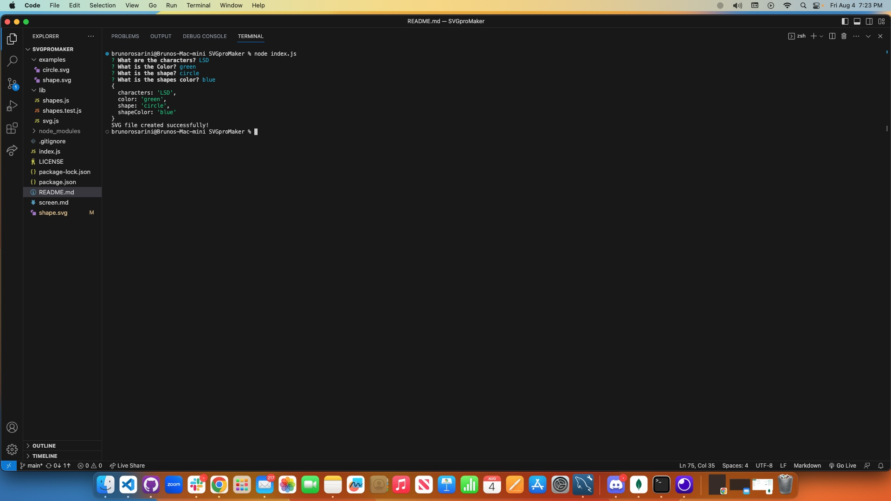
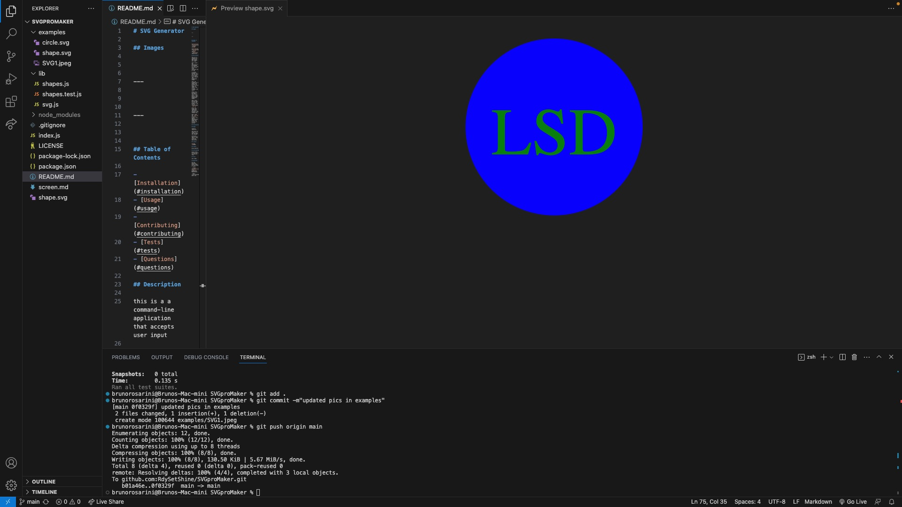

# SVG Generator

## Images

---

---

## Table of Contents

- [Installation](#installation)
- [Usage](#usage)
- [Contributing](#contributing)
- [Tests](#tests)
- [Questions](#questions)

## Description

this is a a command-line application that accepts user input

when I start the application I am prompted for text I can enter up to three characters for my logo

I am then prompted for the text color which allows me to enter a color keyword (OR a hexadecimal number)

then I am prompted for a shape which presents me with a list of shapes to choose from: circle, triangle, and square

after I am prompted for the shape's color, I can enter a color keyword (OR a hexadecimal number)

when I have entered input for all the prompts a SVG file is created named `logo.svg`

after the output text "Generated logo.svg" is printed in the command line

when I open the `logo.svg` file in a browser I am shown a 300x200 pixel image that matches the criteria I entered

## Installation

## Usage

clone my repository

then open the folder in vs code and open the terminal

afterwards type in "node index.js" to start the application

## License

[Title](LICENSE)

## Creator

Bruno Rosarini

## Contributing

Austin Grech
Krishna The TA
Luis Sanchez Tutot

## Tests

test video: https://drive.google.com/file/d/197qyS5HXe1R-kBFdQp8bhyz8dlQvjXZA/view

## Questions

For any questions, please reach out via GitHub or email:

- GitHub: [BrunoRosarini](https://github.com/RdySetShine)

- Email: (rosarinibruno@gmail.com)